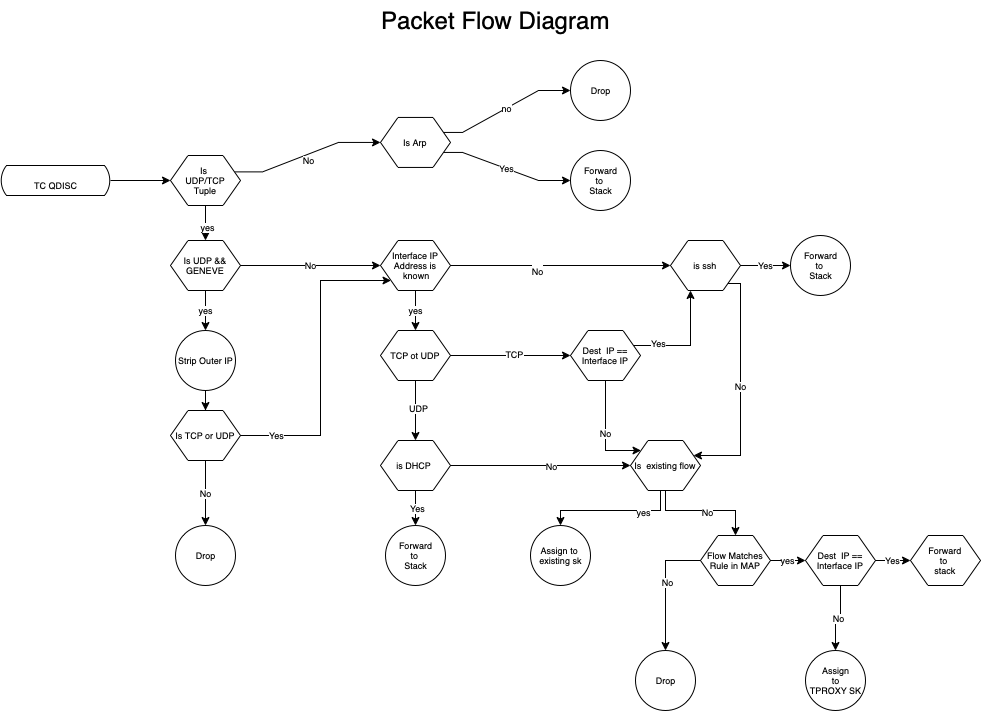

# Intro:

This is a project to develop an eBPF program that utilizes tc-bpf to act as a statefull ingress FW and to redirect ingress ipv4 udp/tcp flows toward dynamically created sockets that coorespond to zero trust based services on OpenZiti edge-routers. Note: For this to work the ziti-router code had to be modified to not insert ip tables tproxy rules for the services defined and to instead call map_update/map_delete_elem for tproxy redirection. example edge code at https://github.com/r-caamano/edge/tree/v0.26.10 assumes map_update and map_delete binaries are in ziti-the router binaries search path and the eBPF program is loaded via linux tc command per instructions below.  Those interested on how to setup an openziti development environment should visit https://github.com/openziti/ziti.  In a later release I will be working on writing the MAP update/delete directly via GO rather than via
system calls to external binaries.  Also note this is eBPF tc based so interception only occurs for traffic ingressing on the interface that the eBPF program is attached to.  To intercept packets generated locally by the router itself the eBPF program would need to be attached to the loopback interface. The eBPF program also provides stateful inbound firewalling and only allows ssh, dhcp and arp bypass by default. Initially the program will allow ssh to any address inbound however after the first tproxy mapping is inserted by the map_update tool it will only allow ssh addressed to the IP address of the interface that tc has loaded the eBPF program.  All other traffic must be configured as a service in an open ziti controller which then informs the router which flows to allow in. The open ziti edge-router then uses the map_update userspace app to insert rules to allow traffic in on the interface tc is running on.
For those interested in additional background on the project please visit: https://openziti.io/using-ebpf-tc-to-securely-mangle-packets-in-the-kernel-and-pass-them-to-my-secure-networking-application.

  prereqs: **Ubuntu 22.04 server** (kernel 5.15 or higher)

        sudo apt update
        sudo apt upgrade
        sudo reboot
        sudo apt install -y gcc clang libc6-dev-i386 libbpfcc-dev libbpf-dev
            

  compile:
        
        mkdir ~/repos
        cd repos
        git clone https://github.com/r-caamano/ebpf-tproxy-splicer.git 
        cd ebpf-tproxy-splicer/src
        clang -O2 -Wall -Wextra -target bpf -c -o tproxy_splicer.o tproxy_splicer.c
        clang -O2 -Wall -Wextra -o map_update map_update.c
        clang -O2 -Wall -Wextra -o map_delete_elem map_delete_elem.c 
       
  attach:
        
        sudo tc qdisc add dev <interface name>  clsact
        sudo tc filter add dev <interface name> ingress bpf da obj tproxy_splicer.o sec sk_tproxy_splice
        sudo ufw allow in on <interface name> to any
        
        ebpf will now take over firewalling this interface and only allow ssh, dhcp and arp till ziti
        services are provisioned as inbound intercepts via the map_udate app. Router will statefully allow responses to router
        initiated sockets as well. tc commands above do not survive reboot so would need to be added to startup service / script.
        
        Test with ziti-router after attaching - 
        if you want to run with ziti-router build a ziti network and create services as explained at https://openziti.github.io
        select "Host It Anywhere"

        The router you run with ebpf should be on a separate VM and you will want to build the binary as described in the README.md at 
        https://github.com/r-caamano/edge/tree/v0.26.10
       
        Copy the user space map programs to folder in $PATH i.e
        sudo cp map_update /usr/bin
        sudo cp map_delete_elem  /usr/bin
        
        You can then run it with the following command "sudo ziti-router run config.yml"

  detach:

        sudo tc qdisc del dev <interface name>  clsact

  Example: Insert map entry to direct SIP traffic destined for 172.16.240.0/24

        Usage: ./map_update <ip dest address or prefix> <prefix length> <low_port> <high_port> <tproxy_port> <protocol id>
        sudo ./map_update 172.16.240.0 24 5060 5060 58997 17 
  
  Example: Insert FW rule for local router tcp listen port 443 where local router's tc interface ip address is 10.1.1.1 with 
  tproxy_port set to 0 signifying local connect rule
  
        sudo ./map_update 10.1.1.1 32 443 443 0 6  

        
 
  Example: Monitor ebpf trace messages

           sudo cat /sys/kernel/debug/tracing/trace_pipe
           
           ziggy@ebpf-router:~$ sudo cat /sys/kernel/debug/tracing/trace_pipe
            <idle>-0       [000] dNs3. 23100.582441: bpf_trace_printk: tproxy_mapping->5060 to 33626
            <idle>-0       [000] d.s3. 23101.365172: bpf_trace_printk: eth1:17
            <idle>-0       [000] dNs3. 23101.365205: bpf_trace_printk: tproxy_mapping->5060 to 33626
            <idle>-0       [000] d.s3. 23101.725048: bpf_trace_printk: eth1:17
            <idle>-0       [000] dNs3. 23101.725086: bpf_trace_printk: tproxy_mapping->5060 to 33626
            <idle>-0       [000] d.s3. 23102.389608: bpf_trace_printk: eth1:17
            <idle>-0       [000] dNs3. 23102.389644: bpf_trace_printk: tproxy_mapping->5060 to 33626
            <idle>-0       [000] d.s3. 23102.989964: bpf_trace_printk: eth1:17
            <idle>-0       [000] dNs3. 23102.989997: bpf_trace_printk: tproxy_mapping->5060 to 33626
            <idle>-0       [000] d.s3. 23138.910079: bpf_trace_printk: eth1:6
            <idle>-0       [000] dNs3. 23138.910113: bpf_trace_printk: tproxy_mapping->22 to 39643
            <idle>-0       [000] d.s3. 23153.458326: bpf_trace_printk: eth0:6
            <idle>-0       [000] dNs3. 23153.458359: bpf_trace_printk: tproxy_mapping->22 to 39643
 
  Example: Remove previous entry from map

        Usage: ./map_delete_elem <ip dest address or prefix> <prefix len> <low_port> <protocol id>
        sudo ./map_delete_elem 172.16.240.0 24 5060 17

  Additional Distro testing:

        Fedora 36 kernel 6.0.5-200

        sudo yum clean all
        sudo yum check-update
        sudo yum upgrade --refresh
        sudo yum install -y clang bcc-devel libbpf-devel iproute-devel iproute-tc glibc-devel.i686 git

        On fedora I found that NetworkManager interferes with eBPF socket redirection and can
        be unpredictable so belowis what I changed to get it working consistently. Other less
        intrusive methods not requiring removal of NM might also be possible.

        sudo yum install network-scripts
        sudo systemctl enable network
        sudo yum remove NetworkManager

        sudo vi /etc/sysconfig/network-scripts/ifcfg-eth0
            if eth0 will be dhcp then something like:

                 BOOTPROTO=dhcp
                 DEVICE=eth0
                 ONBOOT=yes

            or if static

                 BOOTPROTO=static
                 IPADDR=192.168.61.70
                 NETMASK=255.255.255.0
                 DEVICE=eth1
                 ONBOOT=yes

            then:

            The following grub change is only necessary on systems that do not use ethX naming by
            default like vmware.
            #this changes fedora back to using ethX for interface naming network-scripts looks
             for this nomenclature and will fail DHCP otherwise

            sudo vi /etc/default/grub

                change: GRUB_CMDLINE_LINUX="rd.lvm.lv=fedora_fedora/root rhgb quiet"
                to:     GRUB_CMDLINE_LINUX="rd.lvm.lv=fedora_fedora/root rhgb quiet net.ifnames=0 biosdevname=0"

            then:

                sudo grub2-mkconfig -o /boot/grub2/grub.cfg

            #This updates dhcp script to dynamically update systemd-resolved on per interface resolver
            sudo vi /usr/sbin/dhclient-script

            change: if [ -n "${new_domain_name_servers}" ]; then
                        for nameserver in ${new_domain_name_servers} ; do
                            echo "nameserver ${nameserver}" >> "${rscf}"
                        done

            to:     if [ -n "${new_domain_name_servers}" ]; then
                        for nameserver in ${new_domain_name_servers} ; do
                            echo "nameserver ${nameserver}" >> "${rscf}"
                            systemd-resolve --interface "${interface}" --set-dns "${nameserver}"
                        done
  
  
  Analisys:
  
                                                        DIAGRAMS
                                          
   
